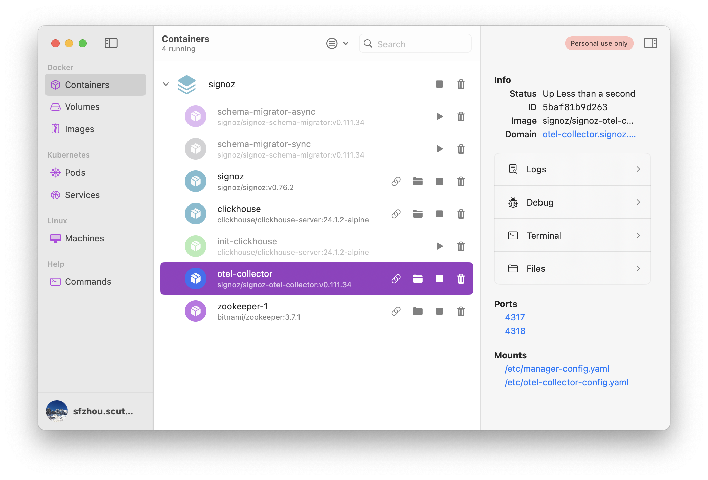
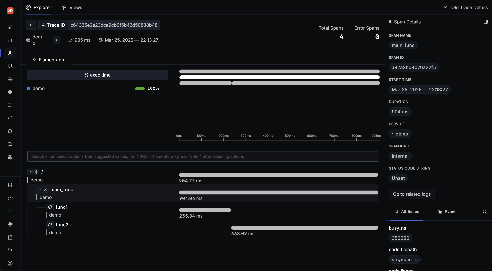

# rocket-opentelemetry-demo

[](https://github.com/SF-Zhou/rocket-opentelemetry-demo/actions/workflows/rust.yml)

### 1. Setup SigNoz

```bash
# 1. download latest code.
git clone -b v0.76.2 https://github.com/SigNoz/signoz.git --depth 1
cd signoz/deploy/docker

# 2. use docker to start a new instance.
docker compose up -d --remove-orphans
```



### 2. Launch Rocket

```bash
# 1. start the demo server.
cargo run --release

# 2. run in another terminal.
curl http://127.0.0.1:8000
#> hello world!
```


